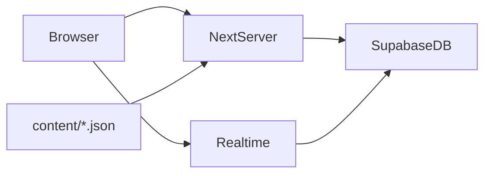

# Verse Clash — Redesign Implementation Plan

Supersedes the original "Round 1 Prototype" plan below (kept out of this file — see git history). Full design reasoning and open questions live in [`docs/redesign-concept.md`](docs/redesign-concept.md); this file tracks what's actually built vs. still to build. See [`CONTEXT.md`](CONTEXT.md) for vocabulary.

## Status

**Implemented so far:** content-pack additions only — the `connector` grammatical role, 49 connector/filler words (subdivided into determiner/demonstrative/conjunction/preposition/auxiliary so a sentence-structure checker can use them), 117 new general-vocabulary words, and a 45-prompt pack (with `prompts.fallback.json` folded in and deleted, since it existed only to backstop the AI prompt generator this redesign removes).

**Not yet implemented:** everything about the actual game loop — the pile/board mechanic, the bracket/series structure, voting rules, Chaos Round, Sabotage, the presentation screen, and AI removal from the runtime. The app today still runs the old dealt-5-options/template/slot loop end to end. Don't assume the sections below describe what `npm run dev` currently does — they describe the target.

## Implementation todos

- [ ] Remove `lib/ai/` entirely and its wiring in `lib/game/runtime.ts` / `lib/game/types.ts` / `lib/content/validate.ts`
- [ ] Strip AI-judged fields (`promptBonus`, `cohesionBonus`, `JudgeScore`) from `lib/scoring/combos.ts`; keep the deterministic bonuses as a display-only flourish
- [ ] Design and build the pile/board data model (replaces dealt-5-options + template/slot composition)
- [ ] Build the Sentence Structure Score checker (grammatical-role pattern matching — see `docs/redesign-concept.md` §7)
- [ ] Build Sabotage (live, single-charge, pile-tile snipe) and Chaos Round (random per-Match event)
- [ ] Build the bracket engine (2-team Series vs. 3/4-team Bracket-with-bye) and voting/fallback rules
- [ ] Add Phaser and build the presentation screen on it (beat sheet, variant-pool SFX/VO/animation, Realtime-driven) — see `docs/redesign-concept.md` §11
- [ ] Rework or retire `content/templates.json` / `content/slots.json` depending on the board-grammar open question

## Locked decisions

- **Stack:** unchanged — Next.js (App Router, TypeScript, Tailwind) + Supabase (Postgres, Realtime, anonymous Auth).
- **No AI at runtime, full stop.** Not for prompts, not for composition, not for judging. Prompt selection is fully automatic (host has zero manual picking) but pulls from the authored pack, never an LLM.
- **The core mechanic is magnet poetry, not fill-in-the-blank.** A Team's Pile of word Tiles gets dragged onto a shared Board by any teammate in real time; any one teammate can Lock In the whole Team. This replaces the old per-player hidden 5-option deal and server-side template assembly.
- **Format depends on team count.** 2 teams → an open-ended Series of Matches, ended by the Host's End Game(s) button, tallied by total Matches won. 3 or 4 teams → a single-elimination Bracket (3 teams gets a bye). Both formats share the same "Next Game" host action and the same tally → winner → credits ending.
- **Voting decides a Match; Sentence Structure Score is the fallback.** Competing Teams' players can vote but not for their own Team; in a Series, the Host/off-team players vote instead since neither Team has a neutral member. No eligible voter, or a tie, falls back to comparing each Team's deterministic Sentence Structure Score — same rule set that grants Sabotage.
- **Sabotage and Chaos Round are the two Chaos Cards worth keeping as designed.** Sabotage is earned live, once per Match, non-accumulating, and spent as a pile-tile snipe. Chaos Round is a random (not team-chosen) per-Match event applied symmetrically to both sides. `no_nouns` and `double_trouble` are still unresolved.
- **Presentation Screen runs on a real browser game engine — Phaser recommended.** A ton of choreographed animation plus randomized variant pools (multiple VO takes, stings, and animations per beat, picked at random with no immediate repeat) isn't practical in plain CSS/DOM. Phaser mounts as a client-only canvas inside the host route, purely as a rendering/playback layer over the same server-authoritative Realtime state — it owns no game logic. Player devices (pile, board, Lock In) stay plain React; `lib/sfx.ts` and `BackgroundMusic.tsx` keep their current job for lightweight per-player-device feedback. Voiceover is pre-recorded clips authored offline, for a fixed, small vocabulary (team-color-parameterized lines, 2–3 variant takes each) — prompts don't get per-line VO since the prompt bank keeps growing.

## Architecture

Unchanged from the original prototype: Next.js server actions own all mutations, Supabase Postgres is the source of truth, Supabase Realtime pushes live state (now including live Board placements and live Pile depletion, not just phase changes and submit indicators), and anonymous Auth backs reconnect. No LLM sits anywhere in this diagram.

## Content pack

See [`content/README.md`](content/README.md) for the authored shapes. The word bank (`content/words.json`) and prompt pack (`content/prompts.json`) are ready to build against. `content/templates.json` / `content/slots.json` are on hold pending the board-grammar open question in the redesign doc — full freeform Board vs. some structural scaffolding.

## Implementation order

Rough sequencing, not a hard commitment — revisit once the pile/board data model is designed:

1. Remove AI wiring (`lib/ai/`, and its call sites) so the game never depends on it, even accidentally, while the rest is rebuilt.
2. Design the Pile/Board data model and Realtime shape (live shared canvas, tile depletion, Lock In).
3. Build the bracket/Series engine and the voting + Sentence Structure Score fallback rules.
4. Build Sabotage and Chaos Round on top of the Sentence Structure checker.
5. Build the presentation screen beat sheet, extending existing SFX/animation patterns.
6. Resolve the templates/slots question and either retire them or adapt them into board scaffolding.

## Out of scope for now

- Anything not confirmed in `docs/redesign-concept.md` — check that file's open-questions sections before building against an assumption.
- Voice or video.
- Any content mode other than Work Safe.
