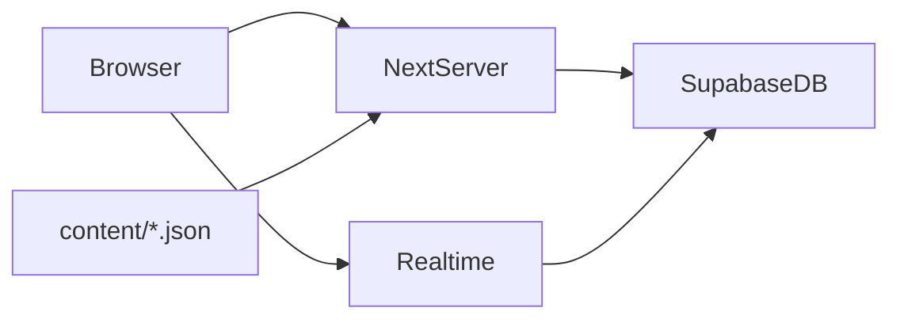
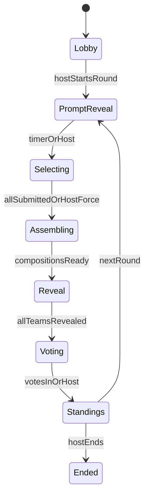

# Verse Clash Round 1 Prototype

Scaffold a Next.js + Supabase remote party-game prototype that runs the full 44-player loop for Round 1 (straight composition), with a documented content-pack schema you can fill yourself. Later round types stay designed-for but unimplemented.

## Implementation todos

- [ ] Scaffold Next.js + Tailwind + Supabase clients and `.env.example`
- [ ] Add content pack types, Zod validator, README, and a tiny sample pack
- [ ] Write Supabase migrations, RLS, and Realtime publication for game tables
- [ ] Implement create/join, anonymous session, teams, ready, host start
- [ ] Deal choices, team room, hidden submit, team chat, timers, host advance
- [ ] Assemble compositions, paced reveal with attribution, reactions, Crowd Favorite, standings, next round

## Locked decisions

- **Stack:** Next.js (App Router, TypeScript, Tailwind) + Supabase (Postgres, Realtime, anonymous Auth)
- **Identity:** No user-facing accounts. Host creates a room; players join with a room code + display name. Room creator is host.
- **Content:** You author it. The game never calls an LLM. We will define a typed content-pack schema, a validator, and one tiny sample pack so the loop is testable.
- **First playable slice:** Full multiplayer loop, **Round 1 only** (straight hidden choices → assemble → reveal → vote → standings → next round). Rounds 2–5 are data-shaped but not implemented.

## Architecture



- **Next.js server actions** own all mutations (create room, join, ready, submit, host advances, vote).
- **Supabase Postgres** is the source of truth for rooms, players, teams, rounds, hidden selections, compositions, votes, chat, and reactions.
- **Supabase Realtime** pushes phase changes, lobby presence, teammate submit indicators, team chat, reveal cursor, and emoji bursts.
- **Silent anonymous Auth** on create/join (no email). This gives RLS so teammates can see *who submitted* but not *what they chose* until reveal.
- **Reconnect:** `localStorage` keeps `roomCode` + player id; refresh reattaches the same anonymous session and hydrates current phase.

Host can play or only facilitate. Host controls always render for the room creator; assigning the host to a team is optional.

## Game state machine



Default phase behavior:

- **Lobby:** names, team assignment (auto-balance + host shuffle/manual move), ready-up, host starts.
- **Prompt reveal:** same prompt for every team.
- **Selecting:** team room + team chat + submit indicators + countdown. Choices stay hidden.
- **Assembling:** server fills the template; no player input.
- **Reveal:** shared stage, one team at a time, contribution-by-contribution, with attribution.
- **Voting:** one category for v1 — **Crowd Favorite**. Simple team win tally.
- **Standings:** Team Goblin 2, Team Waffle 1, …

Host can pause, skip prompt, force-advance, trigger reveal, open voting, show standings, start next round, end game. Unsubmitted players on force-advance get a random choice from their dealt set so the composition still completes.

## Supabase schema (game)

Core tables:

- `rooms` — `code` (6 chars), `host_id`, `status`, `current_round_id`, `content_mode` (`work_safe` only), `paused`
- `players` — `room_id`, `auth_user_id`, `display_name`, `team_id`, `is_host`, `is_ready`, `last_seen_at`
- `teams` — `room_id`, `name`, `color`, `wins` (default names: Goblin, Waffle, Penguin, Stapler)
- `rounds` — `room_id`, `number`, `type` (`straight` for v1), `prompt_id`, `template_id`, `phase`, `phase_ends_at`
- `round_assignments` — `round_id`, `player_id`, `team_id`, `slot_id`, `options` (jsonb), `selected_option_id`, `submitted_at`
- `compositions` — `round_id`, `team_id`, `segments` (jsonb)
- `reveal_state` — `round_id`, `team_index`, `segment_index` (host-paced or timed)
- `votes` — `round_id`, `player_id`, `team_id` (one vote per player)
- `reactions` — `round_id`, `player_id`, `emoji`, `created_at` (aggregate in UI)
- `team_messages` — `room_id`, `team_id`, `player_id`, `body`

RLS essentials:

- Players read their room.
- Team chat only if `team_id` matches.
- `round_assignments.options` / `selected_option_id` readable by the owning player always; readable by others only after the round is in `reveal` or later.
- Host-only writes for phase transitions, team moves, pause.

## Content pack you will author

You only need to fill files under `content/`. The app loads and validates them at boot / round start. We will add TypeScript types, a Zod (or similar) validator, and `content/README.md`.

For Round 1 with ~11 players per team, each prompt needs a template with **11 contribution slots**. Extra players later can share overflow slots; missing players get house-filler words from `defaults` on that slot.

### `content/prompts.json`

```ts
{
  id: string
  text: string                    // shown to everyone
  tease?: string                  // optional one-liner
  formatHint: string              // "wedding vows", "campfire story"
  compatibleTemplateIds: string[]
  workplaceSafe: true
}
```

Need **at least 3 prompts** so host skip is useful. 8 is better.

### `content/templates.json`

A template is static connective language + ordered slots:

```ts
{
  id: string
  promptIds: string[]
  title: string
  segments: Array<
    | { type: "static"; text: string }
    | { type: "slot"; slotId: string }
  >
}
```

Static segments own articles, pronouns, prepositions, punctuation. Players only supply the interesting words.

### `content/slots.json`

One record per slot (11 per template). This is also the player-facing prompt:

```ts
{
  id: string
  templateId: string
  playerLabel: string             // "Choose a description"
  grammaticalRole: "adjective" | "noun" | "verb" | "noun_phrase" | "verb_phrase"
  semanticCategory: "object" | "animal" | "food" | "weather" | "office" | "fantasy" | "place" | "action" | "emotion" | "adjective" | "profession" | "abstract"
  tone: "neutral" | "sincere" | "dramatic" | "absurd"
  intensity: 1 | 2 | 3
  positionPreference: "any" | "end_of_sentence" | "callback_later"  // unused in r1, keep the field
  repetitionPotential: number     // 0-1, unused in r1
  chaosValue: number              // 0-1, unused in r1
  safetyConstraints: string[]     // e.g. ["no_body_parts", "no_romance"]
  defaultFiller: string           // used if that player never submits
}
```

Players see `playerLabel` + 5 options. They do **not** see the template or neighboring slots.

### `content/words.json`

A shared bank. At round start the server **deals** 5 options per assignment:

- 2 `sensible` (`chaos <= 0.3`)
- 2 `strange` (`chaos` 0.31–0.7)
- 1 `chaos` (`chaos > 0.7`)

```ts
{
  id: string
  text: string
  grammaticalRole: "adjective" | "noun" | "verb" | "noun_phrase" | "verb_phrase"
  semanticCategory: string
  tone: string
  intensity: 1 | 2 | 3
  chaos: number
  workplaceSafe: true
  bannedPairCategories?: string[] // combinational safety
  compatiblePromptIds?: string[]  // empty = all
}
```

**Volume to author for a 44-player room:** per grammatical role you actually use, plan on **~25–40 words** so 4 teams × 5 dealt options can stay unique *within a team*. Cross-team reuse is fine (all teams play the same template independently).

Suggested first banks: adjectives, nouns/objects, verbs, noun phrases (“the office printer”), one “something important” phrase bank.

### `content/safety.json`

```ts
{
  blockedTerms: string[]
  bannedCategoryPairs: Array<[string, string]>
  contentMode: "work_safe"
}
```

Validator runs when content loads and again when a composition is assembled. Failures replace the offending token with that slot’s `defaultFiller`. Conservative: if unsure, replace.

Include unused-but-typed fields for later hidden effects (`echo`, `dramatic_placement`, `callback`, `intensifier`) so Round 2 does not require a content rewrite.

## Composition + reveal (Round 1)

After a team’s 11 selections exist, the server walks the template, interpolates selected text, and stores `segments`:

```ts
{ type: "static"; text: string }
| { type: "contribution"; text: string; playerId: string; displayName: string; slotId: string }
```

Reveal UI (shared stage, not team room):

- Host (or timed auto-advance) walks `reveal_state`
- Static text appears normally
- Contributions pop larger, then show “Selected by Priya”
- Global emoji reactions: 😂 👏 🤯 ❤️ 😮 — bursts only, no global chat
- Then next team, then voting

## UX surfaces

| Route | Who | What |
|---|---|---|
| `app/page.tsx` | anyone | Create room / join with code + name |
| `app/room/[code]/page.tsx` | player | One adaptive view: lobby, team room, reveal, vote, standings |
| `app/room/[code]/host/page.tsx` | host | Player list, teams, ready, phase, timers, preview prompt + word pools, advance/pause/skip/reveal/vote/standings/end |

Always visible: phase name, what to do, timer, team name, submitted yes/no, teammates still choosing.

Team room: prompt, personal 5-choice set (big buttons), team chat, submit ticks, countdown. No other players’ words.

Favor large type, big buttons, screen-share-friendly layout. Light visual polish only.

## App / folder layout

```
app/
  page.tsx
  room/[code]/page.tsx
  room/[code]/host/page.tsx
  actions/          # createRoom, joinRoom, setReady, submitChoice, host commands, vote, chat, react
components/         # Lobby, TeamRoom, RevealStage, Voting, HostDashboard
lib/game/           # phases, dealChoices, assembleComposition, safety
lib/content/        # load + zod schema
lib/supabase/       # browser + server clients
content/            # your JSON packs + README
supabase/migrations/
```

## Implementation order

1. **Scaffold** Next.js app, Tailwind, env template (`NEXT_PUBLIC_SUPABASE_URL`, `NEXT_PUBLIC_SUPABASE_ANON_KEY`, `SUPABASE_SERVICE_ROLE_KEY`), Supabase clients. Document enabling Anonymous Auth in the Supabase project.
2. **Content contract** — types, validator, `content/README.md`, one sample prompt/template/11 slots + enough words to deal a 4-person test table (your full 11-slot / 44-player pack can land in the same files).
3. **Migrations + RLS + Realtime** for the tables above.
4. **Lobby loop** — create/join, presence, teams, ready, host start.
5. **Round 1 select loop** — deal unique 5-option sets, team chat, submit indicators, host force-advance.
6. **Assemble + reveal + reactions** — server composition, paced attribution, emoji bursts.
7. **Vote + standings + next round** — Crowd Favorite, team wins, return to prompt reveal with the next authored prompt.

## Out of scope for this slice

- Runtime LLM generation
- Rounds 2–5 behavior (crossover, misdirection, hidden effects)
- Voice / video
- Individual scoreboards and accolades
- Extra content modes beyond Work Safe
- Global chat during reveal
- Visual polish beyond a clear, playful, readable UI

## What you should start writing now

Fill `content/prompts.json`, `content/templates.json`, `content/slots.json`, and `content/words.json` using the shapes above. Minimum for a real 44-player session:

- 3+ workplace-safe prompts
- 1 template per prompt, **11 slots**, connective static text already written
- Word banks tagged with `chaos` so we can deal 2/2/1
- `defaultFiller` on every slot
- No sexual, romantic-physical, body-part, substance, violent, political, or religious-mockery vocabulary — including combinations

A 2–4 player sample pack will ship in-repo so engineering can run without the full 44-player set.
